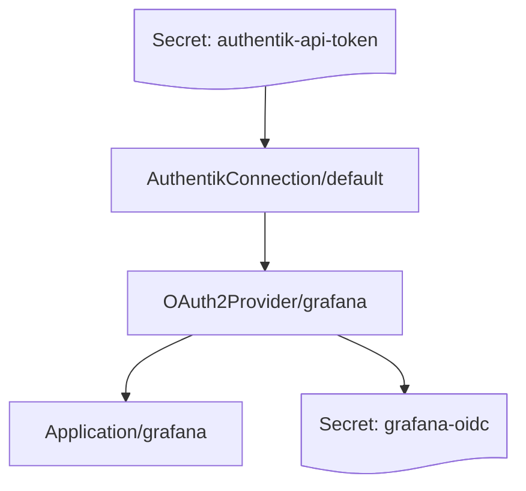

# Your first application

An end-to-end example: a connection, an OAuth2 provider, an application, and a
workload consuming the generated credentials. We will use Grafana, because its
OIDC configuration is short enough to fit on a page.

## What we are building



| | |
| --- | --- |
| `authentik-api-token` | Your authentik API token. You create this one. |
| `AuthentikConnection/default` | Which authentik, and with what token. |
| `OAuth2Provider/grafana` | How Grafana authenticates. |
| `Application/grafana` | What users click in the authentik library. |
| `grafana-oidc` | `client-id`, `client-secret` and `issuer`, written by the operator and read by Grafana. |

## 0. Prerequisites

The operator installed ([Installation](installation.md)), and a `Secret` holding
an authentik API token ([Creating an API token](api-token.md)):

```sh
kubectl create namespace my-apps
kubectl create secret generic authentik-api-token \
  --namespace my-apps \
  --from-file=token=./token.txt
```

## 1. The connection

```yaml title="connection.yaml"
apiVersion: authentik.k8s.rka.sh/v1alpha1
kind: AuthentikConnection
metadata:
  name: default
  namespace: my-apps
spec:
  url: https://authentik.example.com
  tokenSecretRef:
    name: authentik-api-token
    key: token
  probeInterval: 5m
```

```sh
kubectl apply -f connection.yaml
kubectl -n my-apps wait --for=condition=Ready authentikconnection/default --timeout=60s
```

Do not go further until this is `Ready`. Everything downstream refuses to
reconcile against a connection that is not, and reports `ConnectionNotReady`
rather than a useful error of its own.

```sh
$ kubectl -n my-apps get akconn
NAME      URL                             VERSION    READY   AGE
default   https://authentik.example.com   2026.8.2   True    12s
```

## 2. What the provider references

A provider does not name a flow by slug. It references a `Flow` **resource**,
and that resource says which authentik flow is meant. Same for property mappings
and certificate key pairs.

```yaml title="references.yaml"
apiVersion: authentik.k8s.rka.sh/v1alpha1
kind: Flow
metadata:
  name: provider-authorization
  namespace: my-apps
spec:
  connectionRef:
    name: default
  existingSlug: default-provider-authorization-implicit-consent
---
apiVersion: authentik.k8s.rka.sh/v1alpha1
kind: Flow
metadata:
  name: provider-invalidation
  namespace: my-apps
spec:
  connectionRef:
    name: default
  existingSlug: default-provider-invalidation-flow
---
apiVersion: authentik.k8s.rka.sh/v1alpha1
kind: PropertyMapping
metadata:
  name: oidc-openid
  namespace: my-apps
spec:
  connectionRef:
    name: default
  existingName: "authentik default OAuth Mapping: OpenID 'openid'"
---
apiVersion: authentik.k8s.rka.sh/v1alpha1
kind: PropertyMapping
metadata:
  name: oidc-email
  namespace: my-apps
spec:
  connectionRef:
    name: default
  existingName: "authentik default OAuth Mapping: OpenID 'email'"
---
apiVersion: authentik.k8s.rka.sh/v1alpha1
kind: PropertyMapping
metadata:
  name: oidc-profile
  namespace: my-apps
spec:
  connectionRef:
    name: default
  existingName: "authentik default OAuth Mapping: OpenID 'profile'"
---
apiVersion: authentik.k8s.rka.sh/v1alpha1
kind: CertificateKeyPair
metadata:
  name: self-signed
  namespace: my-apps
spec:
  connectionRef:
    name: default
  existingName: authentik Self-signed Certificate
```

This is one level of indirection more than writing the slug inline, and it buys
two things. Changing which flow every provider authorises against becomes one
edit instead of one per provider. And when the operator learns to *create*
flows, that capability lands in the `Flow` manifest — nothing referencing it
has to change.

More in [References between resources](../guides/references.md).

## 3. The OAuth2 provider

```{ .yaml .annotate title="provider.yaml" }
apiVersion: authentik.k8s.rka.sh/v1alpha1
kind: OAuth2Provider
metadata:
  name: grafana
  namespace: my-apps
spec:
  connectionRef:
    kind: AuthentikConnection      # (1)!
    name: default

  adoptionPolicy: FailOnConflict   # (2)!
  deletionPolicy: Delete

  authorizationFlow:               # (3)!
    name: provider-authorization
  invalidationFlow:
    name: provider-invalidation

  clientType: confidential
  redirectURIs:
    - matchingMode: strict
      url: https://grafana.example.com/login/generic_oauth

  propertyMappings:                # (4)!
    - name: oidc-openid
    - name: oidc-email
    - name: oidc-profile

  signingKeyPair:                  # (5)!
    name: self-signed

  accessTokenValidity: hours=1
  refreshTokenValidity: days=30

  writeCredentialsTo:              # (6)!
    name: grafana-oidc
```

1. Optional — `AuthentikConnection` is the default. Set it to
   `ClusterAuthentikConnection` to use a cluster-scoped connection.
2. The default. The reconcile fails rather than taking over a pre-existing
   authentik provider named `grafana`. See
   [ADR 0002](../decisions/0002-adoption-policy.md).
3. A reference to a `Flow` **resource**, declared below — not to a slug and not
   to a UUID.
4. References to `PropertyMapping` resources, in order.
5. A reference to a `CertificateKeyPair` resource.
6. Where the operator writes the generated client credentials. The `Secret` is
   created in this resource's own namespace.

### When a reference does not resolve

The provider reports `Ready=False` with reason `ReferenceNotFound`, naming the
field and the resource:

```
spec.authorizationFlow: Flow "provider-authorization" has not resolved in authentik yet
```

Two things produce it. The `Flow` resource is missing — a typo in the reference.
Or it exists but has not resolved its own `existingSlug` yet, which is what you
see for a few seconds after applying everything at once, and which clears
itself. A slug that exists in staging but was never created in production stays
there, and the `Flow` is the resource to describe.

`ReferenceAmbiguous` is the other outcome: property mapping names are not unique
in authentik, so a `PropertyMapping` whose `existingName` matches several is
refused rather than bound to an arbitrary one.

## 4. The application

```{ .yaml .annotate title="application.yaml" }
apiVersion: authentik.k8s.rka.sh/v1alpha1
kind: Application
metadata:
  name: grafana
  namespace: my-apps
spec:
  connectionRef:
    name: default

  adoptionPolicy: FailOnConflict
  deletionPolicy: Delete

  slug: grafana                    # (1)!
  name: Grafana
  group: Observability             # (2)!

  providerRef:                     # (3)!
    kind: OAuth2Provider
    name: grafana

  metaDescription: Dashboards and alerting
  metaLaunchUrl: https://grafana.example.com
  metaPublisher: Platform team

  policyEngineMode: any
```

1. The slug is authentik's identity for the application and appears in its URLs.
   Changing it later renames the object in authentik.
2. Optional. Groups applications in the user-facing library page.
3. A reference to a provider resource in this namespace — not to an authentik
   primary key.

### Ordering does not matter

`Application.provider` in authentik's API is an **int32 primary key**, which
only exists once the provider has actually been created. So an `Application`
applied before its provider cannot be fully created.

It does not fail. It waits:

- The `Application` is admitted and reconciled.
- The provider reference does not resolve yet, so it reports `Ready=False` with
  reason `ReferenceNotFound` and requeues with backoff.
- When the `OAuth2Provider` becomes ready and publishes its numeric
  `status.remoteID`, the `Application` reconciles again and converges.

This matters for GitOps, where a whole directory is applied at once in
whatever order the tool chose. `kubectl apply -f .` converges; it does not
require you to sequence the files.

```sh
kubectl apply -f references.yaml -f provider.yaml -f application.yaml
kubectl -n my-apps wait --for=condition=Ready application/grafana --timeout=120s
```

!!! tip "Watching convergence"

    ```sh
    kubectl -n my-apps get application grafana -w
    ```

    Seeing `ReferenceNotFound` for a few seconds after a bulk apply is normal.
    Seeing it for minutes means the provider itself is not becoming ready —
    check the provider, not the application.

## 5. Consume the credentials

The operator creates `grafana-oidc` in `my-apps` with three keys:

| Key | Contents |
| --- | --- |
| `client-id` | The OAuth2 client ID authentik generated |
| `client-secret` | The OAuth2 client secret authentik generated |
| `issuer` | The issuer URL, so an OIDC client can discover the rest |

Rename any of them with `writeCredentialsTo.clientIDKey`, `clientSecretKey` and
`issuerKey`.

```yaml title="grafana-deployment.yaml"
env:
  - name: GF_AUTH_GENERIC_OAUTH_ENABLED
    value: "true"
  - name: GF_AUTH_GENERIC_OAUTH_CLIENT_ID
    valueFrom:
      secretKeyRef:
        name: grafana-oidc
        key: client-id
  - name: GF_AUTH_GENERIC_OAUTH_CLIENT_SECRET
    valueFrom:
      secretKeyRef:
        name: grafana-oidc
        key: client-secret
  - name: GF_AUTH_GENERIC_OAUTH_AUTH_URL
    value: https://authentik.example.com/application/o/authorize/
  - name: GF_AUTH_GENERIC_OAUTH_TOKEN_URL
    value: https://authentik.example.com/application/o/token/
  - name: GF_AUTH_GENERIC_OAUTH_API_URL
    value: https://authentik.example.com/application/o/userinfo/
```

!!! warning "Environment variables do not reload"

    A Pod reads `secretKeyRef` values once, at start. If the client secret is
    ever regenerated, the Pod keeps the stale value until it restarts. See
    [Credentials](../guides/credentials.md) for the rotation procedure.

## 6. Verify

```sh
kubectl -n my-apps get akconn,oauth2provider,application
kubectl -n my-apps get secret grafana-oidc
```

Then open your authentik library page. Grafana should appear under
**Observability**, and clicking it should land you in a logged-in Grafana.

If it does not:

```sh
kubectl -n my-apps describe application grafana
kubectl -n my-apps describe oauth2provider grafana
kubectl -n my-apps get events --sort-by=.lastTimestamp
```

Work bottom-up — connection, then provider, then application. A failure at one
layer shows up as `ConnectionNotReady` or `ReferenceNotFound` at the layer
above, and chasing the symptom rather than the cause wastes time.

## Cleaning up

```sh
kubectl delete -f application.yaml -f provider.yaml -f references.yaml
```

With `deletionPolicy: Delete` (the default) the authentik objects go too. Set
`deletionPolicy: Orphan` to keep them — useful when handing an object back to
manual management, or when tearing down a cluster whose authentik outlives it.

The generated `grafana-oidc` `Secret` is owned by the `OAuth2Provider` and is
garbage-collected with it.

## Next

- [Connections](../guides/connections.md) — choosing between the two kinds.
- [Providers](../guides/providers.md) — SAML and proxy providers, and reference resolution in depth.
- [Credentials](../guides/credentials.md) — rotation, and why secrets never appear in `status`.
- [Troubleshooting](../operations/troubleshooting.md) — when the above does not work.
