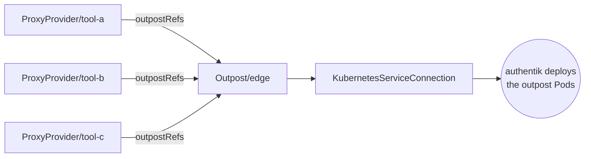

# Outposts

An outpost is a component authentik deploys *outside* itself to enforce
authentication where authentik cannot reach directly — a forward-auth proxy in
front of an application, a LDAP or RADIUS endpoint. It sits off to the side of
the connection → provider → application chain rather than in it.

## Where outposts sit



One outpost serves many providers, and each provider says which outposts should
serve it. Membership is declared on the provider, so onboarding an application
edits that application's manifests and nothing else — the outpost is not a
shared file every team has to touch.

!!! note "An outpost is a deployment, not a policy"

    It has no opinion about who may access what — that lives in the providers
    and their policy bindings. The outpost is the process that enforces them.

## `Outpost`

```{ .yaml .annotate }
apiVersion: authentik.k8s.rka.sh/v1alpha1
kind: Outpost
metadata:
  name: edge
  namespace: my-apps
spec:
  connectionRef:
    kind: AuthentikConnection
    name: default

  adoptionPolicy: FailOnConflict
  deletionPolicy: Delete

  type: proxy                     # proxy | ldap | radius

  serviceConnectionRef:           # (1)!
    kubernetesServiceConnectionName: in-cluster

  config:                         # (2)!
    authentik_host: https://authentik.example.com
    authentik_host_insecure: false
    log_level: info
    kubernetes_replicas: 2
    kubernetes_namespace: my-apps
```

1. Optional, and it names the kind by which field is set:
   `kubernetesServiceConnectionName` or `dockerServiceConnectionName`, never
   both. Omit it entirely for a manually deployed outpost — see
   [Outposts the operator does not own](#outposts-the-operator-does-not-own).
2. Passed through to authentik. The accepted keys are authentik's, not this
   operator's.

## Membership is declared on the provider

A provider names the outposts that should serve it:

```yaml
apiVersion: authentik.k8s.rka.sh/v1alpha1
kind: ProxyProvider
metadata:
  name: tool-a
  namespace: my-apps
spec:
  connectionRef:
    name: default
  authorizationFlow:
    name: provider-authorization
  invalidationFlow:
    name: provider-invalidation
  externalHost: https://tool-a.example.com
  mode: forward_single

  outpostRefs:
    - name: edge
```

Each reference is resolved to the provider's numeric `status.remoteID` before
anything is written, for the same reason as
[`Application.providerRef`](applications.md#the-provider-is-an-int32-primary-key):
authentik keys providers by primary key, and the operator refuses to put
unreviewable integers in manifests.

!!! success "An outpost keeps providers it did not get from the operator"

    Membership is **additive**. The operator remembers which providers it
    attached, in `status.managedProviderIDs`, and on each reconcile sends that
    set plus anything already attached that it did not put there.

    So a provider attached by hand, or by a second operator instance sharing the
    authentik, stays attached. Without the record the two cases are
    indistinguishable — "somebody added this" and "the operator added this and
    the reference is gone" look identical from the spec, and they need opposite
    actions.

!!! success "Partial readiness waits rather than partially applying"

    If any referenced provider is not yet ready, the operator sets
    `Ready=False` with reason `ReferenceNotFound`, **writes nothing**, and
    requeues.

    It deliberately does not assign the subset that happens to resolve. A
    half-assigned outpost is worse than an unassigned one: some applications are
    protected and some silently are not, and the difference is invisible from
    the outpost's own status.

The condition message names which references are outstanding, so a stuck
outpost after a bulk apply tells you which provider to investigate.

!!! warning "Removing an outpostRef unprotects that application immediately"

    Deleting the reference detaches the provider on the next reconcile.
    Whatever it was protecting is served without authentication from then on,
    unless another outpost also carries it.

    There is no confirmation and no grace period. Treat an edit to `outpostRefs`
    as a change to your security posture, not a configuration tidy-up.

### Types

`proxy`

:   Forward-auth for applications with no SSO support. Serves every
    `ProxyProvider` assigned to it.

`ldap`

:   An LDAP endpoint backed by authentik, for software that speaks only LDAP.

`radius`

:   A RADIUS endpoint, typically for network equipment and VPNs.

The types are not mixable: one outpost serves one type, and every provider
naming it must be of the matching kind.

## Service connections

A service connection tells authentik **where and how** to deploy the outpost.
Without one, authentik configures an outpost but deploys nothing — you run the
container yourself.

Both kinds are namespaced resources holding a reference to a `Secret`.

### `KubernetesServiceConnection`

```yaml
apiVersion: authentik.k8s.rka.sh/v1alpha1
kind: KubernetesServiceConnection
metadata:
  name: in-cluster
  namespace: my-apps
spec:
  connectionRef:
    name: default

  local: true                     # (1)!

  # For a remote cluster instead:
  # local: false
  # kubeconfigSecretRef:
  #   name: remote-cluster-kubeconfig
  #   key: kubeconfig

  verifySSL: true
```

1. `local: true` means "the cluster authentik itself runs in", using
   authentik's own in-cluster service account. No kubeconfig needed.

!!! danger "A kubeconfig here is rarely low-privilege"

    Deploying an outpost means creating Deployments, Services and Secrets. A
    kubeconfig that can do that in the target cluster is a substantial
    credential, and it is handed to **authentik**, which then holds it.

    Scope it to a single namespace with a dedicated ServiceAccount. Do not reuse
    a cluster-admin kubeconfig because it was the one to hand.

!!! warning "`local: true` gives authentik deployment rights in its own cluster"

    It uses authentik's own service account. Whether that account can create
    workloads depends on how authentik was installed — and if it can, anyone who
    can create an outpost in authentik can create workloads in that cluster.

### `DockerServiceConnection`

```yaml
apiVersion: authentik.k8s.rka.sh/v1alpha1
kind: DockerServiceConnection
metadata:
  name: edge-host
  namespace: my-apps
spec:
  connectionRef:
    name: default

  url: tcp://docker.internal:2376

  tlsAuthentication:              # client certificate
    name: docker-client-cert
  tlsVerification:                # the daemon's CA
    name: docker-ca
```

Both name `CertificateKeyPair` resources, not `Secret`s: the certificate has to
exist in authentik for authentik to use it, so it is an authentik object this
operator references like any other.

!!! danger "Docker daemon access is usually root on the host"

    Anything that can talk to a Docker daemon can start a privileged container
    with the host filesystem mounted. A `DockerServiceConnection` hands that
    capability to authentik.

    Always use TLS client certificates. An unauthenticated `tcp://` daemon
    reachable from your cluster is a serious exposure regardless of this
    operator.

## Outposts the operator does not own

Not every outpost is one to create. authentik ships an **embedded outpost**
running inside the authentik server, and a cluster may already have outposts
somebody else set up. An `Outpost` can point at either instead of describing a
new one:

```yaml
apiVersion: authentik.k8s.rka.sh/v1alpha1
kind: Outpost
metadata:
  name: embedded
  namespace: my-apps
spec:
  connectionRef:
    name: default
  embedded: true          # or: existingOutpostName: shared-edge
```

Providers then name it like any other outpost. `type`, `config`,
`serviceConnectionRef` and `name` are rejected here: they describe an outpost
this operator builds, and a referenced one keeps the shape it already has.

The embedded outpost is found by the marker authentik stamps on it, not by its
display name — the name is editable and translated, and matching on it would
break the moment somebody renamed it.

!!! danger "A referenced outpost is never created and never deleted"

    `deletionPolicy` is forced to `Orphan`, whatever the manifest says. Deleting
    the resource detaches the providers the operator attached and leaves the
    outpost itself alone.

    This is not a convenience. authentik updates outposts with a full replace,
    so an operator that treated the embedded outpost as its own would wipe its
    type and configuration on the first reconcile — and deleting it because a
    manifest was removed is not something reapplying the manifest fixes.

!!! tip "Prefer the embedded outpost until you need not to"

    Managed outposts exist for cases the embedded one cannot serve: a different
    cluster, a Docker host, a network segment authentik cannot reach. Each one
    costs you a high-privilege credential held by authentik. If you do not need
    that, do not create it.

## Status

| Field | Meaning |
| --- | --- |
| `status.conditions` | `Ready` and `Synced`. See [Conditions](../reference/conditions.md). |
| `status.observedGeneration` | The `metadata.generation` this status reflects. |
| `status.remoteID` | authentik's identifier — a **UUID** for outposts, unlike the numeric key providers get. |
| `status.remoteName` | Name last observed in authentik. |
| `status.adopted` | Whether this took over a pre-existing outpost. |
| `status.providerIDs` | Every provider attached, including any attached outside the operator. |
| `status.managedProviderIDs` | The providers this operator attached. Detaching only ever removes from this set. |
| `status.lastSyncedTime` | Last successful reconcile. |

!!! note "`Ready` means configured, not running"

    `Ready=True` says authentik accepted the outpost definition and the provider
    assignments. It does **not** say the outpost Pods started, became healthy,
    or connected back to authentik.

    Check that in authentik's own outpost view, or by looking at the workloads
    the service connection created. An outpost that is `Ready` here and not
    running there means traffic is unprotected.

## Common problems

| Symptom | Cause | Fix |
| --- | --- | --- |
| `ReferenceNotFound`, message names a provider | A referenced provider is not ready | `describe` that provider. Nothing was written to authentik. |
| `ReferenceNotFound`, message names the service connection | Typo, or the resource is in another namespace | References resolve within the outpost's own namespace. |
| `Ready=True` but no outpost Pods | No `serviceConnectionRef`, or authentik lacks rights in the target | Check authentik's own outpost view for its deployment errors. |
| Outpost Pods run but do not connect | `config.authentik_host` unreachable from where the outpost runs | It must be reachable from the outpost, which may be a different network from the operator. |
| Application served unauthenticated | Its provider names no outpost | A `ProxyProvider` enforces nothing until an outpost carries it. Check its `outpostRefs`. |
| `InvalidSpec` mentioning type | Providers naming this outpost mix kinds, or do not match `spec.type` | One outpost, one type. |

More at [Troubleshooting](../operations/troubleshooting.md).

## See also

- [Providers](providers.md#proxyprovider) — proxy providers, which need an outpost.
- [Security](../operations/security.md) — blast radius of kubeconfigs and Docker credentials.
- [Connections](connections.md) — how `connectionRef` resolves.
