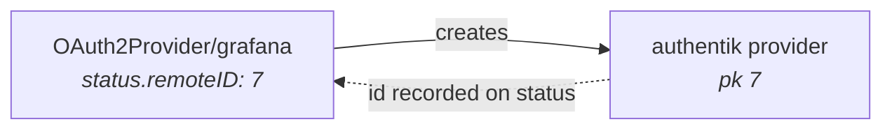
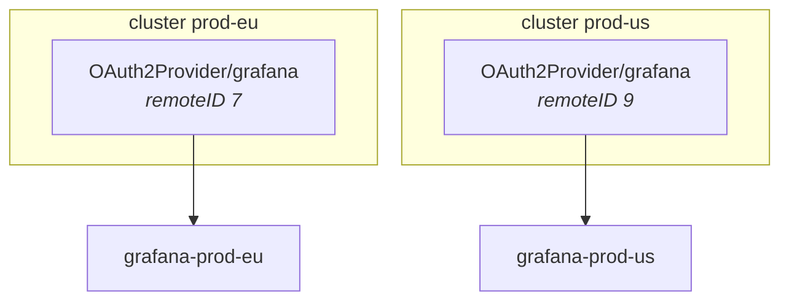

# Ownership and deletion

authentik has no tagging system. There is no label, annotation or owner field on
a provider that could say "this one belongs to that operator", so the question
of which objects an operator may delete has to be answered somewhere else.

This page is where that answer is written down.

## The record lives on the custom resource

When the operator creates or adopts an authentik object it records authentik's
own identifier in `status.remoteID`:



Everything downstream keys off that value:

| Question | Answered by |
| --- | --- |
| Which authentik object is this resource's? | `status.remoteID` |
| Did this operator create it? | `status.remoteID` equals the ID found by name |
| What does deleting this resource delete? | Exactly `status.remoteID`, never "the object with this name" |

`status.remoteID` holds whatever authentik uses to address that kind: a numeric
primary key for providers, the slug for an application, a UUID for everything
else.

!!! note "There is no local state, and there should not be"

    The operator writes no state to disk and needs no volume. The record already
    lives in etcd, replicated and backed up with the cluster, and scoped to the
    lifetime of the resource that owns it.

    A local cache would add a second source of truth that can disagree with the
    first after a restore or a re-apply, and an `ReadWriteOnce` volume would pin
    the operator to one node and one replica — which is exactly what leader
    election exists to avoid.

## Deletion deletes an ID, not a name

```go
if status.RemoteID == "" {
    return true, nil          // nothing was ever created
}
err := req.Adapter.Delete(ctx, status.RemoteID)
```

Two consequences worth knowing:

- **Renaming is safe.** An object renamed on either side is still found, because
  the ID did not change.
- **A resource that never reconciled deletes nothing.** An empty `remoteID`
  means no authentik object was created, so the finalizer is released
  immediately rather than guessing at a name.

## Several operators, one authentik

Each operator install has its own etcd, its own custom resources, and its own
`remoteID` values. Deleting by ID is what keeps them apart: operator A removes
provider `7` and cannot touch operator B's provider `9`, whatever either is
called.

Names are the half that needs help, which is what
[`connection.spec.cluster`](connections.md#several-operators-one-authentik)
provides. Without it both operators compute the same name, and whichever
reconciles second finds the other's object by name and either refuses it as a
conflict or adopts it.



Outpost membership works the same way and is described under
[Outposts](outposts.md#membership-is-declared-on-the-provider): the operator
records the providers it attached in `status.managedProviderIDs` and detaches
only from that set, so a provider attached by another operator instance or by
hand survives.

## When the record is lost

If `status.remoteID` is lost while the resource remains — a partial restore, or
someone stripping status — the next reconcile finds the object by name and sees
that the recorded ID does not match. It then applies `adoptionPolicy`:

`FailOnConflict` (the default)

:   Refuses, with `AdoptionConflict` naming the object it found. Nothing is
    changed. This is deliberate: an operator that silently took over whatever
    shared its name would be indistinguishable from one that had quietly
    adopted another team's provider.

`AdoptExisting`

:   Takes ownership and records the ID. Use it once you have confirmed the
    object really is the one this resource should manage.

See [ADR 0002](../decisions/0002-adoption-policy.md) for why the default is the
strict one.

## What is not covered

!!! warning "A resource removed while the operator is down leaks its object"

    Deleting a custom resource while the operator is not running — or forcing it
    past its finalizer with `--grace-period=0`, or deleting the namespace with
    the operator offline — leaves the authentik object in place with nothing
    recording that it existed.

    No amount of operator-side bookkeeping fixes this. The resource is gone, so
    nothing expresses that a deletion was ever intended; acting on a leftover
    local record would mean deleting authentik objects with no live owner, which
    is a worse failure than leaking one.

    The finalizer is what normally prevents it: deletion of the resource blocks
    until the authentik object is gone. Set `deletionPolicy: Orphan` for
    anything you would rather leak than lose.

## See also

- [Connections](connections.md#several-operators-one-authentik) — cluster identity.
- [Outposts](outposts.md#membership-is-declared-on-the-provider) — additive membership.
- [ADR 0002 — Adoption policy](../decisions/0002-adoption-policy.md).
- [Conditions](../reference/conditions.md) — `AdoptionConflict` and the rest.
